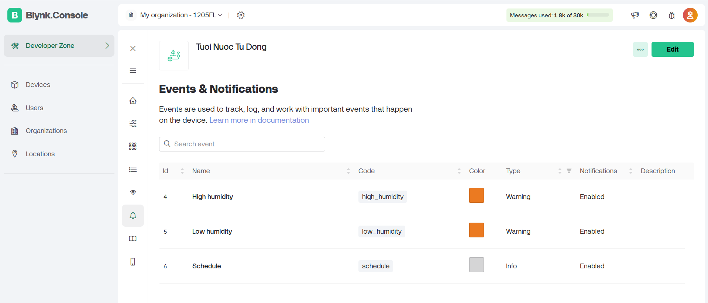

# Table of contents
- [Hệ Thống Tưới Tự Động Sử Dụng ESP8266 NodeMCU và Blynk](#hệ-thống-tưới-tự-động-sử-dụng-esp8266-nodemcu-và-blynk)
  * [1. Giới thiệu](#1-giới-thiệu)
    + [Chức năng chính:](#chức-năng-chính)
  * [2. Yêu cầu hệ thống](#2-yêu-cầu-hệ-thống)
    + [Phần cứng:](#phần-cứng)
    + [Phần mềm:](#phần-mềm)
  * [3. Sơ đồ kết nối phần cứng](#3-sơ-đồ-kết-nối-phần-cứng)
  * [4. Cài đặt phần mềm](#4-cài-đặt-phần-mềm)
    + [4.1. Cài đặt Arduino IDE và board ESP8266](#41-cài-đặt-arduino-ide-và-board-esp8266)
      - [Bước 1: Tải và cài đặt Arduino IDE](#bước-1-tải-và-cài-đặt-arduino-ide)
      - [Bước 2: Cài đặt board ESP8266 vào Arduino IDE](#bước-2-cài-đặt-board-esp8266-vào-arduino-ide)
    + [4.2. Cài đặt thư viện cho Arduino IDE](#42-cài-đặt-thư-viện-cho-arduino-ide)
      - [Bước 1: Cài thư viện ESP8266WiFi](#bước-1-cài-thư-viện-esp8266wifi)
      - [Bước 2: Cài thư viện Blynk](#bước-2-cài-thư-viện-blynk)
      - [Bước 3: Cài thư viện Time và NTPClient](#bước-3-cài-thư-viện-time-và-ntpclient)
  * [5. Cài đặt Blynk App (Legacy)](#5-cài-đặt-blynk-app-legacy)
    + [5.1. Tải và cài đặt Blynk App (Legacy)](#51-tải-và-cài-đặt-blynk-app-legacy)
    + [5.2. Đăng ký tài khoản và đăng nhập](#52-đăng-ký-tài-khoản-và-đăng-nhập)
    + [5.3. Tạo project Blynk](#53-tạo-project-blynk)
    + [5.4. Thêm datastreams và các widget vào template](#54-thêm-datastreams-và-các-widget-vào-template)
  * [6. Cách sử dụng hệ thống](#6-cách-sử-dụng-hệ-thống)
    + [6.1. Các chế độ hoạt động](#61-các-chế-độ-hoạt-động)
    + [6.2. Điều chỉnh ngưỡng độ ẩm](#62-điều-chỉnh-ngưỡng-độ-ẩm)
    + [6.3. Hiển thị trạng thái và thời gian](#63-hiển-thị-trạng-thái-và-thời-gian)
  * [7. Chức năng các đoạn mã và lưu đồ giải thuật](#7-chức-năng-các-đoạn-mã-và-lưu-đồ-giải-thuật)
    + [7.1. `setup()`](#71-setup)
    + [7.2. `loop()`](#72-loop)
    + [7.3. `updateDisplay()`](#73-updatedisplay)
    + [7.4. `checkHumidityAndSendAlerts()`](#74-checkhumidityandsendalerts)
    + [7.5. `controlRelayByMode()`](#75-controlrelaybymode)
    + [7.6. `controlRelayAutomatically()`](#76-controlrelayautomatically)
    + [7.7. `controlRelayManually()`](#77-controlrelaymanually)
    + [7.8. `controlRelayBySchedule()`](#78-controlrelaybyschedule)
    + [7.9. `updateTimeDisplay()`](#79-updatetimedisplay)
    + [7.10. `BLYNK_WRITE(VPIN_MODE_SELECT)`](#710-blynk_writevpin_mode_select)
    + [7.11. `BLYNK_WRITE(VPIN_HUMIDITY_THRESHOLD_HIGH)` và `BLYNK_WRITE(VPIN_HUMIDITY_THRESHOLD_LOW)`](#711-blynk_writevpin_humidity_threshold_high-và-blynk_writevpin_humidity_threshold_low)
    + [7.12. `BLYNK_WRITE(VPIN_RELAY_CONTROL)`](#712-blynk_writevpin_relay_control)
    + [7.13. `BLYNK_WRITE(VPIN_TIME_INPUT)`](#713-blynk_writevpin_time_input)
    + [7.14. Lưu đồ giải thuật](#714-lưu-đồ-giải-thuật)
  * [8. Xử lý sự cố](#8-xử-lý-sự-cố)
    + [8.1. ESP8266 không kết nối được WiFi](#81-esp8266-không-kết-nối-được-wifi)
    + [8.2. Ứng dụng Blynk không hiển thị đúng thông tin](#82-ứng-dụng-blynk-không-hiển-thị-đúng-thông-tin)
    + [8.3. Relay không hoạt động](#83-relay-không-hoạt-động)
    + [8.4. Bơm nước không hoạt động](#84-bơm-nước-không-hoạt-động)
    + [8.5. Đèn LED cảnh báo không sáng](#85-đèn-led-cảnh-báo-không-sáng)
    + [8.6. Không nhận được thông báo qua email](#86-không-nhận-được-thông-báo-qua-email)
    + [8.7. Không đồng bộ được thời gian thực từ NTP server](#87-không-đồng-bộ-được-thời-gian-thực-từ-ntp-server)
  * [9. Ghi chú](#9-ghi-chú)
    + [9.1. An toàn về điện](#91-an-toàn-về-điện)
    + [9.2. Bảo trì hệ thống](#92-bảo-trì-hệ-thống)
    + [9.3. Tối ưu hóa năng lượng](#93-tối-ưu-hóa-năng-lượng)
  * [10. Thông tin liên hệ](#10-thông-tin-liên-hệ)

------


# Hệ Thống Tưới Tự Động Sử Dụng ESP8266 NodeMCU và Blynk

## 1. Giới thiệu

Hệ thống tưới tự động này sử dụng vi điều khiển ESP8266 kết hợp với app Blynk (phiên bản legacy) và các cảm biến, relay để kiểm soát quá trình tưới nước cho cây trồng. Dự án này cho phép bạn điều khiển quá trình tưới tự động dựa trên độ ẩm của đất hoặc theo thời gian đã thiết lập. Bạn cũng có thể theo dõi và điều khiển hệ thống từ xa qua smartphone.

### Chức năng chính:
- Điều khiển hệ thống tưới tự động dựa trên độ ẩm đất.
- Điều khiển thủ công qua ứng dụng Blynk.
- Hẹn giờ tưới nước dựa trên ngày và thời gian thiết lập.
- Gửi cảnh báo qua email và thông báo đẩy trên điện thoại khi độ ẩm đất vượt quá mức an toàn.
- Hiển thị thời gian thực và trạng thái hệ thống (gồm đồ thị theo thời gian, giá trị dạng số và trạng thái: cao, thấp, bình thường của độ ẩm, led cảnh báo,...) trên ứng dụng Blynk.

---

## 2. Yêu cầu hệ thống

### Phần cứng:
- **NodeMCU ESP8266**.
- **Relay 5V có Opto cách ly kích mức High/Low**: Điều khiển máy bơm nước.
- **Cảm biến độ ẩm đất dùng LM393**: Để đo độ ẩm.
- **Bơm nước 12V RS385**: Để tưới nước.
- **LED đỏ, xanh, vàng**: Để hiển thị trạng thái cảnh báo của hệ thống.
- **Dây kết nối, test board**, **nguồn 5V** cho relay và ESP8266.
- **Nguồn tổ ong 12V-5A** cho máy bơm.

### Phần mềm:
- **Arduino IDE**: Dùng để lập trình ESP8266.
- ~~**Blynk App (Legacy)**: Điều khiển và giám sát hệ thống qua smartphone.~~
- **Thư viện cần thiết:** ESP8266, Blynk, Time, NTPClient.
- **Cập nhât**: Đã có **Blynk** phiên bản **2.0**, cập nhật thêm nhiều tính năng mới và sửa một vài lỗi tồn đọng ở phiên bản cũ.
---

## 3. Sơ đồ kết nối phần cứng

| ESP8266 Pin | Kết nối với     | Mô tả                            |
|-------------|-----------------|-----------------------------------|
| D2          | Relay        | Điều khiển relay                  |
| D5          | LED đỏ          | Cảnh báo độ ẩm thấp               |
| D6          | LED xanh        | Báo độ ẩm bình thường             |
| D7          | LED vàng        | Báo độ ẩm cao                     |
| A0          | Cảm biến độ ẩm đất | Đọc giá trị độ ẩm đất            |

Sơ đồ chi tiết cho các chân kết nối và linh kiện sẽ được cung cấp trong phần hình ảnh minh họa.


---

## 4. Cài đặt phần mềm

### 4.1. Cài đặt Arduino IDE và board ESP8266

#### Bước 1: Tải và cài đặt Arduino IDE
- Truy cập [trang tải xuống Arduino IDE](https://www.arduino.cc/en/software) và tải về phiên bản mới nhất.
- Cài đặt IDE trên máy tính của bạn.

#### Bước 2: Cài đặt board ESP8266 vào Arduino IDE
- Mở Arduino IDE.
- Vào **File > Preferences**.
- Trong phần **Additional Boards Manager URLs**, thêm đường dẫn sau:

  ```
  http://arduino.esp8266.com/stable/package_esp8266com_index.json
  ```

- Nhấn **OK**.
- Vào **Tools > Board > Boards Manager** và tìm kiếm "ESP8266".
- Chọn **Install** để cài đặt board ESP8266.

### 4.2. Cài đặt thư viện cho Arduino IDE

#### Bước 1: Cài thư viện ESP8266WiFi
- Trong Arduino IDE, vào **Tools > Manage Libraries**.
- Tìm kiếm `ESP8266WiFi` và chọn **Install**.

#### Bước 2: Cài thư viện Blynk
- Tương tự, tìm và cài thư viện `Blynk` từ **Manage Libraries**.

#### Bước 3: Cài thư viện Time và NTPClient
- Tìm kiếm `Time` và `NTPClient`, sau đó chọn **Install**.

---

## ~~5. Cài đặt Blynk App (Legacy)~~

### ~~5.1. Tải và cài đặt Blynk App (Legacy)~~
- ~~**iOS**: Truy cập [App Store](https://apps.apple.com) và tìm kiếm **Blynk Legacy** để tải về.~~
- ~~**Android**: Truy cập [APKMirror](https://www.apkmirror.com) và tìm kiếm **Blynk Legacy** để tải về.~~
- **Cập nhật**: **Blynk App Legacy** đã bị xóa, vì vậy chúng ta sẽ dùng phiên bản mới có tên là **Blynk IoT**. Vào cửa hàng ứng dụng tùy theo hệ điều hành của bạn, tìm từ khóa **Blynk IoT** và tải về. Sau đó tiến hành tạo tài khoản và tạo project tương tự như ở bản **Blynk Legacy** mà tôi đã trình bày ở đây.

### 5.2. Đăng ký tài khoản và đăng nhập
- Mở app Blynk, chọn **Create New Account** và nhập email và mật khẩu để đăng ký tài khoản.
- ~~Nhập thông tin **Custom Server** như sau~~
    - ~~**Server URL:** **blynk-server.com**~~
    - ~~**Port**: **9443**~~
- ~~Nếu bạn muốn tự dựng server của riêng mình tham khảo [tại đây](https://github.com/Peterkn2001/blynk-server)~~

### 5.3. Tạo project Blynk
- Sau khi đăng nhập, vào **Developer Zone**, sau đó nhấn dấu `+ New Template` để tạo một template mới. Lúc này bạn sẽ tạo giao diện app điều khiển theo hướng dẫn ở **mục 5.4**.
- Chọn **Devices**, chọn **Template** là cái chúng ta đã tạo ở trên, chọn **phần cứng** là **ESP8266** và chọn **Connection Type** là **WiFi**.
- Nhấn **Create** để tạo **Devices**, bạn sẽ nhận được mã `auth_token`, `template_name`, `template_id` qua **email** và trên trang cấu hình của **Blynk**. Lưu mã này để dùng trong code.

### 5.4. Thêm datastreams và các widget vào template
- **Styled Button Widget (V9)**: Điều khiển relay khi ở chế độ thủ công.
- **Value Display Widget (V1)**: Hiển thị độ ẩm đất.
- **LCD Widget (V6)**: Hiển thị trạng thái độ ẩm (cao, thấp, bình thường) trên LCD.
- **Time Input Widget (V15)**: Cài đặt thời gian hẹn giờ tưới nước.
- **LED Widget (V10, V11, V12)**: Hiển thị trạng thái cảnh báo bằng màu LED (đỏ, xanh, vàng tương ứng với độ ẩm thấp, bình thường, cao).
- **Numeric Input (V3, V4)**: Thiết lập ngưỡng trên và ngưỡng dưới phù hợp cho cây trồng.
- **Value Display (V13, V14)**: Hiển thị thời gian và ngày tháng hiện tại theo thời gian thực.
- **Segmented Switch (V2)**: Chọn chế độ hoạt động để điều khiển relay.
- **SuperChart (V8)**: Đồ thị giá trị độ ẩm theo thời gian.

**V9, V1, V6**... là các Datastreams tương ứng với widget đó.
  Bạn có thể tham khảo cách sắp xếp các widget như hình:

  
  

---

## 6. Cách sử dụng hệ thống
Lắp mạch theo sơ đồ ở **Mục 3**, tải về và cấu hình mã nguồn:
- Dán đoạn mã sau vào PowerShell (Windows) hoặc Bash, (Linux) để tải mã nguồn về máy tính:

        git clone https://github.com/Sefany2723/NodeMCU-ESP8266-Blynk-Tuoi-Nuoc-Tu-Dong.git && cd NodeMCU-ESP8266-Blynk-Tuoi-Nuoc-Tu-Dong && .\manguon.ino
- Mở file mã nguồn trong Arduino IDE và cập nhật các thông tin WiFi và Blynk:

        #define BLYNK_AUTH_TOKEN "YOUR_AUTH_TOKEN"
        #define BLYNK_TEMPLATE_ID "YOUR_TEMPLATE_ID"
        #define BLYNK_TEMPLATE_NAME "YOUR_TEMPLATE_NAME"
        char ssid[] = "YOUR_WIFI_SSID";
        char pass[] = "YOUR_WIFI_PASSWORD";

- Tạo event trên trang cấu hình của Blynk để gửi thông báo về mail và điện thoại
  
  
  
  


- Nạp chương trình vào ESP8266
    - Kết nối ESP8266 với máy tính qua cáp USB.
    - Chọn Board là NodeMCU 1.0 và cổng COM tương ứng.
    - Nhấn Upload để nạp chương trình vào ESP8266.
    - **Lưu ý**:
       - Máy tính Windows có thể cần phải cài **[Driver](https://www.silabs.com/developers/usb-to-uart-bridge-vcp-drivers?tab=downloads)**
       - Còn trên Linux nhớ cấp quyền truy cập vào cổng USB bằng lệnh sau
         ```
           sudo chmod 666/dev/ttyUSB0
         ```
### 6.1. Các chế độ hoạt động
- **Chế độ tự động:** Dựa vào ngưỡng độ ẩm đất, hệ thống sẽ tự động bật/tắt relay để điều khiển bơm nước.
- **Chế độ thủ công:** Người dùng có thể bật/tắt bơm nước trực tiếp qua app Blynk.
- **Hẹn giờ tưới nước:** Người dùng có thể cài đặt lịch tưới qua **Time Input Widget** trên app.

### 6.2. Điều chỉnh ngưỡng độ ẩm
- Ngưỡng độ ẩm cao và thấp có thể được điều chỉnh trực tiếp trong mã nguồn hoặc trong app Blynk bằng cách thiết lập giá trị phù hợp với điều kiện cây trồng.

### 6.3. Hiển thị trạng thái và thời gian
- Thời gian và ngày tháng được đồng bộ với NTP server và hiển thị trên **Value Display Widget**.
- Giá trị độ ẩm, đồ thị và trạng thái (cao, thấp, bình thường) của nó cũng hiển thị trên app blynk nhờ widget đã cấu hình ở **mục 5**.

---

## 7. Chức năng các đoạn mã và lưu đồ giải thuật


### 7.1. `setup()`:
- Hàm này thực hiện các thiết lập ban đầu cho hệ thống, bao gồm:
    - Kết nối với WiFi và server Blynk.
    - Thiết lập các chân đầu ra cho đèn LED và relay.
    - Đồng bộ các giá trị từ ứng dụng Blynk như ngưỡng độ ẩm, chế độ hoạt động, và thời gian hẹn giờ.
    - Khởi tạo NTP client để đồng bộ thời gian từ Internet.
    - Thiết lập một bộ hẹn giờ (timer) để thực hiện cập nhật thời gian và điều khiển relay theo chu kỳ.

   **Tác dụng đối với hệ thống**: Đảm bảo hệ thống khởi động chính xác, kết nối với WiFi, server Blynk và đồng bộ các giá trị ban đầu từ ứng dụng.

### 7.2. `loop()`:
- Hàm này được gọi liên tục trong suốt thời gian hoạt động của hệ thống, bao gồm:
     - Thực thi các tác vụ của Blynk (`Blynk.run()`), đảm bảo hệ thống giao tiếp với server Blynk.
     - Thực hiện các tác vụ định kỳ do bộ hẹn giờ thiết lập (`timer.run()`), bao gồm cập nhật hiển thị thời gian và điều khiển relay.
     - Đọc giá trị độ ẩm từ cảm biến và gửi giá trị này lên ứng dụng Blynk.
     - Gọi các hàm điều khiển relay và kiểm tra độ ẩm để đưa ra các cảnh báo cần thiết.

   **Tác dụng đối với hệ thống**: Đảm bảo hệ thống hoạt động liên tục, kiểm soát relay và giám sát giá trị độ ẩm.

### 7.3. `updateDisplay()`:
- Hàm này được gọi mỗi giây để cập nhật thời gian và điều khiển relay theo hẹn giờ.
   
   **Tác dụng đối với hệ thống**: Hiển thị thời gian và quản lý điều khiển relay theo lịch hẹn.

### 7.4. `checkHumidityAndSendAlerts()`:
- Hàm này kiểm tra giá trị độ ẩm hiện tại so với các ngưỡng cao và thấp đã đặt. Nếu độ ẩm vượt ngưỡng, hệ thống sẽ gửi cảnh báo qua ứng dụng Blynk và email. Các đèn LED trên thiết bị cũng sẽ thay đổi trạng thái tương ứng với tình trạng độ ẩm:
     - Đèn đỏ sáng nếu độ ẩm thấp.
     - Đèn vàng sáng nếu độ ẩm cao.
     - Đèn xanh lá sáng nếu độ ẩm ở mức bình thường.

   **Tác dụng đối với hệ thống**: Giúp người dùng giám sát độ ẩm một cách trực quan và qua cảnh báo từ xa (qua ứng dụng và email).

### 7.5. `controlRelayByMode()`:
- Hàm này điều khiển relay dựa trên chế độ hoạt động đã được cài đặt:
     - Chế độ 1 (Tự động): Relay được điều khiển dựa trên giá trị độ ẩm.
     - Chế độ 2 (Thủ công): Người dùng có thể bật/tắt relay bằng nút nhấn trên ứng dụng Blynk.
     - Chế độ 3 (Hẹn giờ): Relay được bật/tắt theo khoảng thời gian đã hẹn trước.

   **Tác dụng đối với hệ thống**: Cho phép điều khiển relay một cách linh hoạt, phù hợp với nhu cầu của người dùng.

### 7.6. `controlRelayAutomatically()`:
- Hàm này điều khiển relay trong chế độ tự động. Nếu độ ẩm vượt ngưỡng cao, relay sẽ tắt. Nếu độ ẩm dưới ngưỡng thấp, relay sẽ bật.

   **Tác dụng đối với hệ thống**: Điều khiển hệ thống tưới nước tự động dựa trên độ ẩm của đất.

### 7.7. `controlRelayManually()`:
- Hàm này điều khiển relay trong chế độ thủ công. Relay sẽ bật/tắt theo trạng thái của nút điều khiển trong ứng dụng Blynk.

   **Tác dụng đối với hệ thống**: Cho phép người dùng tự tay điều khiển hệ thống tưới nước mà không phụ thuộc vào độ ẩm hay lịch hẹn giờ.

### 7.8. `controlRelayBySchedule()`:
- Hàm này điều khiển relay trong chế độ hẹn giờ. Hệ thống sẽ bật/tắt relay dựa trên thời gian hẹn (giờ bắt đầu, giờ kết thúc và các ngày trong tuần mà người dùng đã chọn).

   **Tác dụng đối với hệ thống**: Cung cấp khả năng tưới nước theo lịch hẹn, cho phép người dùng thiết lập thời gian chính xác cho việc bật/tắt hệ thống tưới.

### 7.9. `updateTimeDisplay()`:
- Hàm này lấy thời gian thực từ server NTP và cập nhật lên ứng dụng Blynk (bao gồm giờ:phút:giây và thứ ngày/tháng/năm).

   **Tác dụng đối với hệ thống**: Hiển thị thời gian thực trên ứng dụng Blynk để người dùng theo dõi.

### 7.10. `BLYNK_WRITE(VPIN_MODE_SELECT)`:
- Hàm này xử lý sự kiện khi người dùng thay đổi chế độ hoạt động trên ứng dụng Blynk.

    **Tác dụng đối với hệ thống**: Cho phép người dùng chuyển đổi giữa các chế độ tự động, thủ công, và hẹn giờ.

### 7.11. `BLYNK_WRITE(VPIN_HUMIDITY_THRESHOLD_HIGH)` và `BLYNK_WRITE(VPIN_HUMIDITY_THRESHOLD_LOW)`:
- Hai hàm này xử lý sự kiện khi người dùng thay đổi ngưỡng độ ẩm cao và thấp trên ứng dụng Blynk.

    **Tác dụng đối với hệ thống**: Cập nhật ngưỡng độ ẩm theo yêu cầu của người dùng để điều khiển hệ thống tưới nước.

### 7.12. `BLYNK_WRITE(VPIN_RELAY_CONTROL)`:
- Hàm này xử lý sự kiện khi người dùng bật/tắt relay trong chế độ thủ công.

    **Tác dụng đối với hệ thống**: Điều khiển trạng thái bật/tắt của hệ thống tưới nước trong chế độ thủ công.

### 7.13. `BLYNK_WRITE(VPIN_TIME_INPUT)`:
- Hàm này xử lý dữ liệu đầu vào từ widget Time Input (giờ hẹn) trên ứng dụng Blynk và thiết lập thời gian hẹn cho hệ thống.

    **Tác dụng đối với hệ thống**: Cho phép người dùng hẹn giờ bật/tắt hệ thống tưới nước cho các ngày trong tuần.
### 7.14. Lưu đồ giải thuật

*[Vào link này để xem rõ hơn](https://github.com/Sefany2723/NodeMCU-ESP8266-Blynk-Tuoi-Nuoc-Tu-Dong/blob/main/luudodangcode.mmd)*

---


## 8. Xử lý sự cố

### 8.1. ESP8266 không kết nối được WiFi
- **Nguyên nhân có thể:**
  - Sai tên hoặc mật khẩu WiFi trong mã nguồn.
  - Tín hiệu WiFi yếu hoặc quá xa ESP8266.
  - Mạng WiFi không hỗ trợ 2.4GHz (ESP8266 chỉ hoạt động với băng tần 2.4GHz).
  - Router WiFi có thể đang chặn ESP8266 do cài đặt bảo mật (chẳng hạn lọc MAC).
  
- **Cách khắc phục:**
  - Kiểm tra và đảm bảo tên và mật khẩu WiFi đúng.
  - Đưa ESP8266 lại gần router WiFi để tăng tín hiệu.
  - Kiểm tra và thay đổi cài đặt router để cho phép kết nối của ESP8266.
  - Khởi động lại cả router và ESP8266.

### 8.2. Ứng dụng Blynk không hiển thị đúng thông tin
- **Nguyên nhân có thể:**
  - ESP8266 không kết nối được với server Blynk.
  - `Auth Token` trong mã không khớp với mã trên app Blynk.
  - Server Blynk đang bị gián đoạn hoặc kết nối mạng của bạn yếu.

- **Cách khắc phục:**
  - Kiểm tra kết nối mạng của điện thoại và ESP8266.
  - Đảm bảo `auth token` trong mã nguồn trùng khớp với mã trong email từ Blynk.
  - Khởi động lại app Blynk và kiểm tra lại các thông tin cấu hình.
  - Thử kết nối lại ESP8266 với WiFi hoặc kiểm tra server Blynk qua trang trạng thái của họ.

### 8.3. Relay không hoạt động
- **Nguyên nhân có thể:**
  - Relay không được cấp nguồn đúng cách.
  - Chân điều khiển relay trên ESP8266 không được cấu hình hoặc kết nối chính xác.
  - Lỗi logic trong chương trình khi điều khiển relay.

- **Cách khắc phục:**
  - Kiểm tra nguồn cấp cho relay, đảm bảo relay được cấp nguồn phù hợp.
  - Kiểm tra kết nối dây giữa relay và ESP8266.
  - Đảm bảo chân D2 (hoặc chân khác nếu đã thay đổi) của ESP8266 được lập trình đúng cách để điều khiển relay.
  - Kiểm tra trong chương trình có lệnh điều khiển relay hợp lý không.

### 8.4. Bơm nước không hoạt động
- **Nguyên nhân có thể:**
  - Relay không đóng/mở để cấp điện cho bơm.
  - Nguồn cấp cho bơm nước không đủ hoặc không ổn định.
  - Lỗi kết nối giữa relay và bơm nước.

- **Cách khắc phục:**
  - Kiểm tra nguồn điện cung cấp cho bơm nước, đảm bảo nguồn 12V cấp cho bơm là ổn định.
  - Kiểm tra relay có hoạt động hay không bằng cách nghe tiếng "tạch" khi relay đóng/mở.
  - Kiểm tra kết nối giữa relay và bơm nước.

### 8.5. Đèn LED cảnh báo không sáng
- **Nguyên nhân có thể:**
  - Lỗi kết nối giữa đèn LED và ESP8266.
  - Chân điều khiển đèn LED không được cấu hình chính xác.
  - Lỗi logic trong chương trình điều khiển LED.

- **Cách khắc phục:**
  - Kiểm tra kết nối dây giữa LED và ESP8266.
  - Đảm bảo các chân D5, D6, D7 của ESP8266 được lập trình để điều khiển đèn LED tương ứng.
  - Kiểm tra lại phần mã điều khiển LED để đảm bảo các lệnh được thực thi đúng.

### 8.6. Không nhận được thông báo qua email và app
- **Nguyên nhân có thể:**
  - Cấu hình email không chính xác trong mã nguồn.
  - Server email có thể đang chặn yêu cầu gửi email từ Blynk.
  - Giới hạn gửi email của Blynk đã bị vượt qua (Blynk có giới hạn số lượng email miễn phí hàng ngày).
  - Chưa cấp quyền thông báo ở phần cài đặt của app

- **Cách khắc phục:**
  - Kiểm tra cấu hình email trong mã, đảm bảo đúng định dạng địa chỉ email.
  - Thử sử dụng một địa chỉ email khác hoặc cấu hình server SMTP của riêng bạn.
  - Kiểm tra số lượng email đã được gửi trong ngày, nếu vượt quá giới hạn, hãy đợi sang ngày hôm sau hoặc nâng cấp tài khoản Blynk.
  - Cấp quyền thông báo ở phần cài đặt của app

### 8.7. Không đồng bộ được thời gian thực từ NTP server
- **Nguyên nhân có thể:**
  - Mạng không kết nối được tới NTP server.
  - Sai URL hoặc cấu hình NTP trong mã nguồn.

- **Cách khắc phục:**
  - Kiểm tra kết nối mạng của ESP8266.
  - Đảm bảo URL của NTP server đúng.
  - Thử thay đổi NTP server thành một server khác (chẳng hạn `time.nist.gov` hoặc `pool.ntp.org`).

---

## 9. Ghi chú

### 9.1. An toàn về điện
- **Nguồn điện**: Khi làm việc với bơm nước và relay, hãy đảm bảo nguồn cấp điện (12V cho bơm và 5V cho ESP8266/relay) được kết nối đúng cách và ổn định. Tránh sử dụng nguồn điện quá công suất cho các thiết bị.
- **Tiếp đất**: Đảm bảo rằng tất cả các kết nối điện đều an toàn, đặc biệt khi làm việc với các thiết bị có tiếp xúc với nước. Hãy sử dụng các thiết bị bảo vệ như cầu chì, rơ-le nhiệt để tránh sự cố ngắn mạch hoặc cháy nổ.
- **Cách ly nước và điện**: Trong quá trình tưới nước, cần tránh để nước tiếp xúc với các phần mạch điện để tránh nguy cơ chập điện hoặc giật điện.

### 9.2. Bảo trì hệ thống
- Thường xuyên kiểm tra và vệ sinh cảm biến độ ẩm để đảm bảo cảm biến không bị bám bẩn hoặc bị hỏng do môi trường ẩm ướt.
- Kiểm tra lại dây điện và kết nối của các linh kiện sau một thời gian sử dụng, đặc biệt các dây nối tới bơm nước và relay để đảm bảo không bị lỏng hoặc hỏng.
- Đảm bảo hệ thống luôn được bảo vệ khỏi nước và bụi bằng các hộp bảo vệ, đặc biệt là phần mạch điện và ESP8266.

### 9.3. Tối ưu hóa năng lượng
- Nếu sử dụng hệ thống với pin hoặc nguồn cấp điện năng lượng mặt trời, hãy tối ưu hóa các khoảng thời gian đo lường và cập nhật trạng thái để tiết kiệm năng lượng. Bạn có thể giảm tần suất đọc cảm biến độ ẩm nếu không cần thiết phải đo liên tục.
- Sử dụng các chế độ **Deep Sleep** của ESP8266 để tiết kiệm năng lượng khi hệ thống không cần hoạt động liên tục.

--- 


## 10. Thông tin liên hệ
- **Tác giả:** Trần Ngọc Tới
- **Email:** tranngoctoi219@gmail.com
- **GitHub:** https://github.com/Sefany2723
